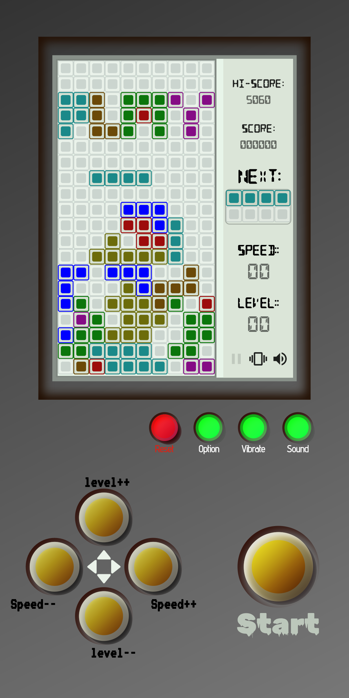
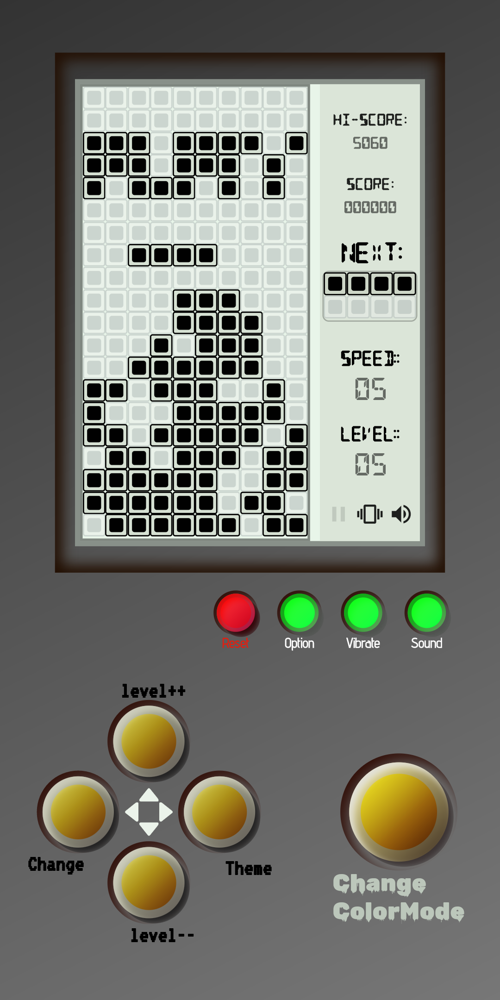
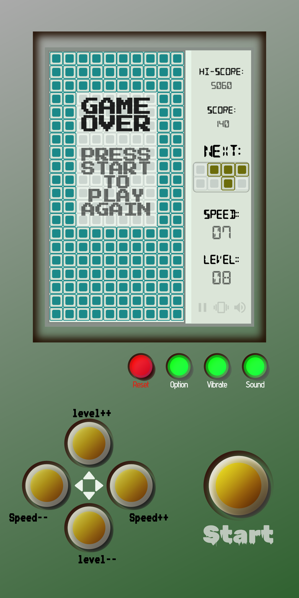
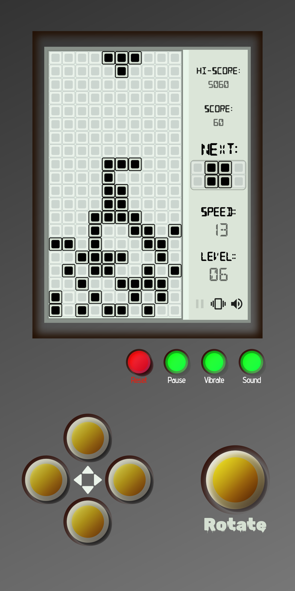

<!-- Tetris Game -->

<p align="center">
  
</p>

<h1 align="center">Tetris Game</h1>

<div align="center">
  Built with Flutter and Riverpod
</div>

<br>

<div align="center">
  <a href="#download-and-play">Download and Play</a>
  ·
  <a href="#features">Features</a>
  ·
  <a href="#screenshots">Screenshots</a>
  ·
  <a href="#installation">Installation</a>
  ·
  <a href="#usage">Usage</a>
  ·
  <a href="#license">License</a>
  ·
  <a href="#acknowledgements">Acknowledgements</a>
  ·
  <a href="#contributing">Contributing</a>
</div>

<br>

## Download and Play

You can download and play the alpha version of our Tetris game on Android. Get the APK from the [Releases](https://github.com/Djerry11/tetris_game/releases) section.

## Features

- **Manual Difficulty Customization**: Set custom levels and speeds to adjust the game's challenge.
- **Immersive Audio and Visuals**: Enjoy captivating audio effects and dynamic visual animations.
- **User Preferences**: Personalize settings for sound effects, color palettes, and backgrounds using `shared_preferences`.
- **Responsive Controls**: Experience smooth and precise piece movements.
- **Progressive Difficulty**: Challenge yourself with increasing difficulty as you clear lines.
- **Efficient State Management**: Utilizes Riverpod and `freezed` for organized state management.
- **Pause and Resume**: Flexibly pause and resume the game as needed.
- **Vibration Feedback**: Feel the game with vibration feedback on crucial events.

## Screenshots

<div align="center">
  
  
  
</div>

<div align="center">
  
  
  
</div>

## Installation

1. Clone the repository:
   ```sh
   git clone https://github.com/Djerry11/tetris_game.git

3. Navigate to the project folder:
   ```sh
    cd tetris_game
   
5. Run the app:
   ```sh
    flutter run

## Usage

- Adjust difficulty settings in-game for a tailored experience.
- Use controls to move, rotate, and drop pieces strategically.
- Clear lines to earn points and challenge yourself.

After cloning the repository and navigating to the project folder, run the app using `flutter run`.

## License

This project is licensed under the MIT License. See the [LICENSE](LICENSE) file for details.

## Acknowledgements

- [Flutter](https://flutter.dev/)
- [Riverpod](https://riverpod.dev/)
- [freezed](https://pub.dev/packages/freezed)
- [shared_preferences](https://pub.dev/packages/shared_preferences)
- SVG images by [SVGRepo](https://www.svgrepo.com/)
- Vibration feedback using Flutter's [`vibration`](https://pub.dev/packages/vibration) package

## Contributing

Contributions are welcome! Please feel free to submit pull requests or open issues if you encounter any problems or have suggestions.

---

<div align="center">
Enjoy the game!
</div>

